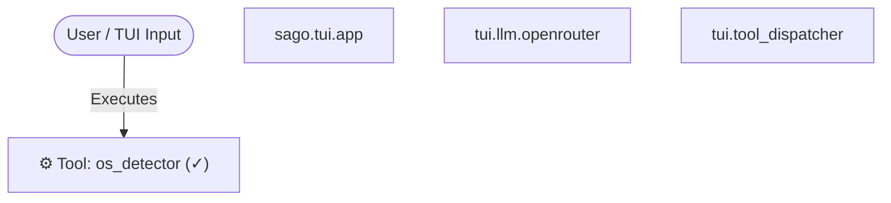

# Session Export: 6e6ddd07-858

- **Session ID:** 6e6ddd07-8587-4341-9405-35da001c3029
- **Agent:** sago-orchestrator
- **Model:** google/gemini-3.5-flash-lite
- **Exported:** 2026-08-15T17:54:45
- **Messages:** 10

---

## Conversation

### USER

hello
### ASSISTANT

❌ **Error:** Rate limited. Wait or check credits at https://openrouter.ai/settings/credits
### USER

hello
### ASSISTANT

❌ **Error:** Rate limited. Wait or check credits at https://openrouter.ai/settings/credits
### USER

cools
### ASSISTANT

❌ **Error:** Rate limited. Wait or check credits at https://openrouter.ai/settings/credits
### USER

hello what can you do all you capablities ??
### ASSISTANT

Hello! I am **Sago Orchestrator**, a production-grade multi-agent AI assistant and software engineering expert built to help you design, build, test, and manage complex software projects.

Here is a breakdown of my core capabilities and what I can do for you:

### 1. **339 Specialist Agents Across 22 Domains**
I can adopt or delegate work to hundreds of specialized agents depending on your exact needs—ranging from **Python, Rust, Go, and TypeScript engineers** to **security engineers, database specialists, DevOps experts, data scientists, and cloud architects**.

### 2. **56+ Production-Grade Tools**
I have direct access to powerful tools to interact with your environment and codebase:
* **File Operations & AST:** Read, write, diff, search (`grep`), and map symbols across large codebases.
* **Database Management:** Inspect schemas, run SQL queries, and generate forward/rollback migrations.
* **Shell & Execution:** Execute shell commands, manage background processes, and run linters/test suites.
* **Network & DevOps:** Perform web searches, crawl sites, manage Docker containers, and handle SSH/SCP operations.
* **Document Processing:** Convert PDFs, spreadsheets, and presentations into clean Markdown (`MarkItDown`).

### 3. **Advanced Architecture & Search**
* **Hybrid BM25 & Dense Semantic Search:** Lightning-fast code and concept searching across your entire repository.
* **Smart Project & Data Graphs:** Generate architectural box diagrams, dependency trees, and Mermaid flowcharts.
* **Continuous Self-Healing Verification:** Automated linting, type-checking, and test verification passes.
* **Atomic Checkpoints & Rollback:** Snapshot your workspace and restore with 1-click safety before major refactors.

### 4. **Interactive TUI & CLI**
* **Terminal UI:** High-density terminal interface with multiple themes, collapsible turn cards, and real-time streaming.
* **Session Persistence:** Save and load sessions securely with SQLite or JSON state preservation.

---

How can I help you today? Whether you want to write code, debug an error, design system architecture, or explore a codebase, just let me know!
### USER

can you tell me my os version ?
### ASSISTANT

❌ **Error:** Rate limited. Wait or check credits at https://console.cloud.google.com/billing
---

## ⚙️ Tool Executions & Sub-Agent Delegations

_No tool usage recorded._

---

## 🗺️ Interaction Graph & Hierarchy



```text
SAGO Execution Interaction Map:
└── User Request
    ├── ⚙️ [TOOL] os_detector ✓ (19.9ms)
```

---

## Token Usage

_No token usage data for this session._
