# SAGO-Agent

> **Production-grade multi-agent orchestration system** — 339 specialist agents, 70 production tools, multi-LLM support, streaming, parallel execution, feedback loops, workflows, containerized card TUI with dashboard, and built-in security.

[](https://python.org)
[](LICENSE)

---

## What is Sago?

Sago is a **production-grade multi-agent orchestration system** built for real-world software engineering tasks. It goes beyond simple code generation — it autonomously delegates work to **339 specialist agents**, uses **70 production tools**, streams responses token-by-token, runs agents in parallel, manages sessions, enforces permissions, and runs workflows.

<table>
  <tr>
    <td>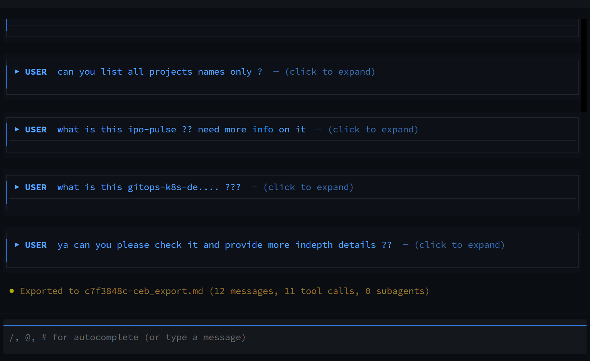</td>
    <td>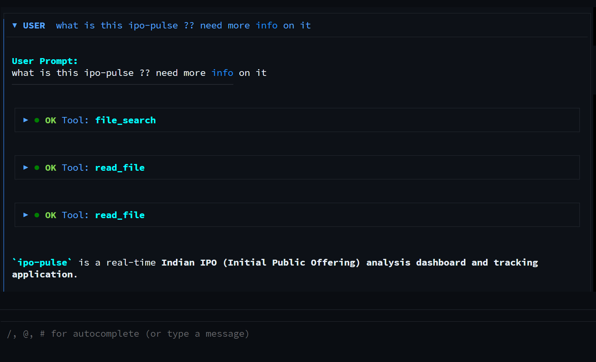</td>
  </tr>
</table>

### Key Capabilities

| Feature | Description |
|---------|-------------|
| **339 Specialist Agents** | Agents across 22 domains (engineering, security, data, cloud, compliance, etc.) with domain-specific tool suites |
| **70 Production Tools** | File ops, AST symbol graphs, database query/schema/migration, interactive MCQ questions, shell, networking, SSH, Docker, and more |
| **Parallel Agent Execution** | Run multiple agents simultaneously on the same task |
| **Feedback Loops** | Agents can request clarification from previous agents in a chain |
| **Recursion Protection** | Depth tracking, cycle detection, and visited-agent guards |
| **Structured Handoffs** | Typed context passing between agents with history tracking |
| **AI-Powered Routing** | `sago smart` asks the LLM to pick the best agent for any task |
| **Token-by-Token Streaming** | Real-time streaming with usage tracking via OpenAI streaming API |
| **Permission System** | Risk-based tool permissions (safe/low/medium/high/critical) with approval workflow |
| **Session Persistence** | SQLite database + JSON file save/load with full state preservation |
| **Workflow Engine** | Stateful multi-step workflows with dependencies, retries, and pausing |
| **Hybrid BM25 & Dense Code Search** | Probabilistic BM25 + zero-dependency 128-d dense vector semantic search across 1,000+ files (`sago search`) |
| **Continuous Background Linting** | Automatic non-blocking verification passes upon file modification with instant diagnostics |
| **4-Tier Hierarchical Memory Pyramid** | 4-tiered context compaction (Architectural goals, deltas, semantic distillation, and working turns) with auto-triggering saving ~70% token overhead |
| **Developer Mode (`/dev`)** | Real-time function execution tracing, LLM payload inspection, and microsecond latency diagnostics — **default ON until v1.0** (`dev_mode: true # TODO: flip to false at 1.0`), fresh install shows Inspector (`F2`) without `/dev on` |
| **Atomic Checkpoints & Rollback** | Point-in-time workspace snapshotting and 1-click restore for large-scale refactoring safety |
| **Smart Project & Data Graph** | Architecture box diagrams, autonomous execution process maps, data model extraction, and Mermaid visualization |
| **Deep Recursive File Mentions (`#file`)** | Recursive workspace fuzzy indexing with Git-modified prioritization and instant context attachment |
| **Detach Mode & Background Workers** | Detached execution for CLI tasks and TUI sessions allowing safe terminal closing with `sago attach` reconnection |
| **Systematic Thinking → Tool Order** | Strict `thinking1 → tool1 → thinking2 → tool2 …` interleaving via `mount_sequential`, per-agent headers (`● {agent} — Technical Reasoning`, `by @agent`), DB `thinking_blocks[].seq` + `tool_usage.created_at` for reload fidelity — see `docs/TUI_CHAT_STRUCTURE.md` §20 |
| **Summary — By Agent (Zero-Tool)** | Auto-mounted `● Summary — by agent` (`collapsed=False`) after chain/orchestrate/parallel/delegate; natural-language “so what was the summary?” reuse cached `PROJECT_ANALYSIS.md` + `ToolUsageStore` + `DevTracer` with single `tool_choice:none` LLM call — 0 wasted tools |
| **Containerized Card TUI** | High-density terminal UI with 11 themes, collapsible turn cards, live agent dashboard, smart autocomplete, and fluid animations |
| **Multi-LLM Support** | OpenRouter, OpenAI, Gemini, Claude, Ollama |
| **Token Cost Tracking** | Per-model pricing with cache hit/miss analytics |
| **Security Audit** | Path traversal protection, secret scanner, input validation, sensitive data filtering |

---

## Quick Start

```bash
# Clone the repository
git clone https://github.com/SAGO-AUTOMATES/SAGO-Agent.git
cd SAGO-Agent

# Install dependencies
pip install -e .

# Set your API key
export OPENROUTER_API_KEY="your-key-here"

# Launch the TUI
sago tui

# Or run tasks from CLI
sago smart "Fix the authentication bug"
sago run "Build a REST API" --agent python-engineer
```

---

## Logging & Debugging

Sago writes detailed logs to `~/.sago/logs/sago.log` with daily rotation (7 days retention).

- **File logs**: DEBUG level - every tool call, API request, error, and decision
- **Console logs**: INFO level - important milestones only

To enable verbose console output:
```python
import logging

logging.getLogger().setLevel(logging.DEBUG)
```

Log files rotate daily at midnight. Each log entry includes:
```
2026-08-19 12:00:00 | INFO     | sago.engine.simple_executor | Task started: agent=python-engineer, model=gemini-2.5-flash
```

Keep log files when reporting bugs - they contain the full execution trace.

---

## Installation

### From Source (Recommended)

```bash
git clone https://github.com/SAGO-AUTOMATES/SAGO-Agent.git
cd SAGO-Agent
pip install -e .
```

### Using uv (Faster)

```bash
git clone https://github.com/SAGO-AUTOMATES/SAGO-Agent.git
cd SAGO-Agent
uv pip install -e .
```

### Documentation & Technical Flows

- 📘 **[Architecture & Execution Flows (docs/FLOWS.md)](docs/FLOWS.md)** — In-depth guide to Vector DB/RAG, Multi-Agent Swarms, Tool Permissions & Self-Healing Verification.
- 🛠️ **[Commands Reference (docs/COMMANDS.md)](docs/COMMANDS.md)** — Complete CLI and TUI slash command reference.
- 📦 **[Project Structure (docs/PROJECT.md)](docs/PROJECT.md)** — Module map, agent registry, and engine layout.
- 🏗️ **[Build & Installation Guide (docs/BUILD.md)](docs/BUILD.md)** — Developer build, test, and dependency instructions.

### Dependencies

- Python 3.11+
- openai (for LLM calls)
- textual (for TUI)
- pydantic (for data validation)

Optional:
- crewai (for CrewAI orchestration path)
- langgraph (for LangGraph workflow engine)
- anthropic (for Claude provider)
- google-generativeai (for Gemini provider)

---

## CLI Commands

See [docs/COMMANDS.md](docs/COMMANDS.md) for full CLI and TUI command reference.

### Core Execution

<table>
  <tr>
    <td>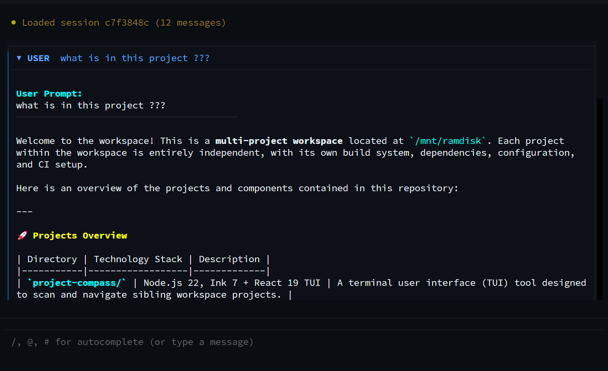</td>
    <td>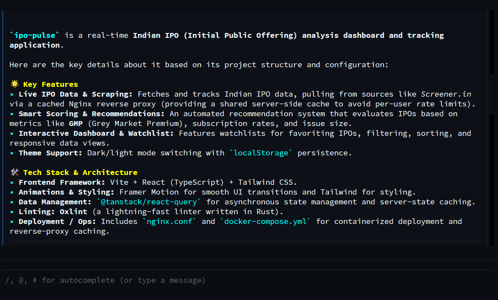</td>
  </tr>
</table>

| Command | Description |
|---------|-------------|
| `sago smart "task"` | **AI-powered execution** — LLM selects best agent, streams response |
| `sago run "task"` | Execute task with auto-orchestration |
| `sago run "task" --agent X` | Use specific agent |
| `sago run "task" --chain X,Y,Z` | Sequential agent chain |
| `sago run "task" --effort high` | Control execution depth (low/medium/high/max) |
| `sago map [--dir .]` | **Symbol Repo Map** — Compact AST symbol map across 1,000+ files |
| `sago parse <file>` | **MarkItDown Document Parser** — Convert PDF, DOCX, XLSX, PPTX, HTML to Markdown |
| `sago project-graph --view llm` | **AI Architecture Analysis** — Generate an LLM-backed report from the project topology |
| `sago verify [--dir .]` | **Self-Healing Verification** — Automated linters, type checks & tests |
| `sago pr create <title>` | **Automated Git PR Workflow** — Branch creation, verification, commit, and PR drafting |
| `sago skills [--filter X]` | List workspace & built-in skills and capabilities |
| `sago plugins` | List loaded third-party plugins and lifecycle hooks |

### Interactive TUI

| Command | Shortcut | Description |
|---------|----------|-------------|
| `sago tui` | — | Launch interactive terminal UI |
| `/help` | — | Show all commands |
| `/graph [view] [path]` | — | Show project topology, diagrams, or AI architectural analysis |
| `/copy [code\|all]` | — | Copy the last response, code block, or chat history to the clipboard |
| `/clip [code\|all]` | — | Alias for `/copy` |
| `/agents [category]` | — | List/search agents by category or name |
| `/agent <name>` | — | Set current agent |
| `/skills [filter]` | — | List workspace & custom skills |
| `/plugins` | — | List third-party plugins |
| `/delegate <agent> <task>` | — | Delegate to specialist |
| `/chain <a1,a2> <task>` | — | Chain agents sequentially |
| `/parallel <a1,a2> <task>` | — | Run agents in parallel on same task |
| `/orchestrate <task>` | — | Auto-delegate to specialists |
| `/dashboard` | `Ctrl+D` | Toggle agent dashboard sidebar |
| `/tasks` | `Ctrl+T` | Show background tasks |
| `/cancel <id\|all>` | `Ctrl+C` | Cancel running task(s) |
| `/handoff` | — | Show handoff targets for current agent |
| `/effort <level>` | — | Set effort: low/medium/high/max |
| `/cost` | — | Token usage and costs |
| `/summary` | — | Toggle task summary display |
| `/save [name]` | — | Save session to file |
| `/load <name>` | — | Load session from file |
| `/compact` | — | Summarize context |
| `/permissions` | — | Show tool permissions |
| `/allow <tool>` | — | Allow a tool |
| `/block <tool>` | — | Block a tool |
| `/git` | — | Git status |
| `/diff [file]` | — | Show diff |
| `/commit <msg>` | — | Commit changes |

### Workflows

| Command | Description |
|---------|-------------|
| `sago workflows` | List all workflows |
| `sago workflow-create "name"` | Create new workflow |
| `sago workflow-add-step <id>` | Add step to workflow |
| `sago workflow-run <id>` | Execute workflow |

### System

| Command | Description |
|---------|-------------|
| `sago status` | System status |
| `sago agents [category]` | List all categories or drill down into a category |
| `sago info <agent>` | Agent details |
| `sago init` | Initialize project |
| `sago daemon start` | Start background server |
| `sago daemon stop` | Stop server |

---

## 339 Agents Across 22 Categories

| Category | Count | Examples |
|----------|-------|----------|
| Specialized Engineering | 71 | security-engineer, devsecops-engineer, blockchain-engineer |
| Engineering Dev | 52 | full-stack-engineer, backend-engineer, mobile-engineer |
| Language Specific | 35 | python-engineer, rust-engineer, go-engineer |
| Data Intelligence | 34 | data-engineer, ml-engineer, ai-engineer |
| Infrastructure Ops | 23 | devops, kubernetes-engineer, terraform-engineer |
| Database Specialists | 16 | postgresql-engineer, mongodb-engineer, redis-engineer |
| Compliance Legal Finance | 16 | gdpr-engineer, soc2-engineer, hipaa-engineer |
| Planning Oversight | 13 | technical-debt-manager, risk-manager, capacity-planner |
| Design Architecture | 12 | solutions-architect, enterprise-architect, security-architect |
| Testing Quality | 11 | qa-engineer, penetration-tester, performance-engineer |
| Orchestration | 10 | engineering-manager, scrum-master, technical-program-manager |
| Content Communication | 10 | technical-writer, documentation-updater, tech-translator |
| Cloud Infra Architecture | 9 | aws-engineer, gcp-engineer, azure-engineer |
| System Extensibility | 6 | agent-builder, prompt-engineer, skill-creator |
| Frontend Frameworks | 5 | react-engineer, vue-engineer, angular-engineer |
| Business Revenue | 5 | developer-advocate, sales-engineer, marketing-engineer |
| People Culture | 3 | technical-recruiter, training-specialist |
| Executive | 3 | cto, vp-engineering, ceo |
| Cloud Providers | 2 | cloudflare-engineer, oracle-cloud-engineer |
| Business Analysis | 2 | business-analyst, data-analyst |
| IT Support | 1 | it-support-engineer |
| Game Development | 1 | game-engineer |

---

## 70 Production Tools

See [docs/TOOLS.md](docs/TOOLS.md) for complete tool documentation with usage examples.

<table>
  <tr>
    <td>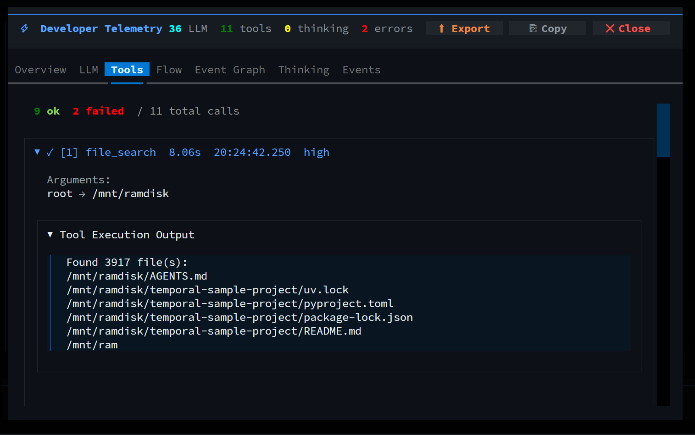</td>
    <td>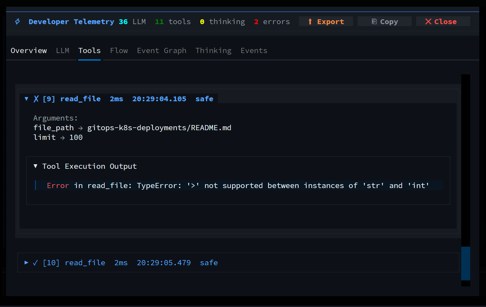</td>
  </tr>
</table>

### File Operations
- `read_file` — Read file contents
- `write_file` — Write files with auto-directory creation
- `glob_files` — Pattern-based file search
- `grep_content` — Regex content search
- `file_operations` — Move, copy, delete, rename, mkdir, list
- `archive` — Create/extract zip, tar, tar.gz, tar.bz2
- `hash_checksum` — MD5, SHA1, SHA256, SHA512
- `diff_tool` — Compare files/text
- `regex_tester` — Test/debug regular expressions
- `pdf_reader` — Extract text from PDFs
- `data_processor` — JSON/YAML parse, validate, format, query, merge

### Shell & System
- `execute_shell` — Run shell commands
- `background_process` — Run commands in background
- `process_manager` — List/kill processes
- `env_info` — System, disk, memory, network info
- `env_manager` — Environment variable management
- `os_detector` — Detect operating system
- `cron_schedule` — Manage scheduled tasks
- `screenshot` — Capture screenshots

### Network
- `http_client` — API requests (GET, POST, PUT, DELETE)
- `web_crawler` — Crawl websites, extract content
- `dns_lookup` — DNS resolution
- `port_scan` — Scan ports
- `network_config` — Network configuration info

### SSH
- `ssh_connect` — SSH connections
- `ssh_command` — Execute remote commands
- `ssh_transfer` — File transfer via SCP/SFTP

### Coding
- `code_analyzer` — Code structure, complexity, issues
- `linter` — Code linting
- `formatter` — Code formatting
- `test_runner` — Run tests
- `debugger` — Debug with breakpoints, AST analysis
- `log_analyzer` — Analyze log files
- `text_summarizer` — Summarize text

### DevOps
- `docker_ops` — Docker ps, build, run, compose
- `git_ops` — Git status, log, diff, commit, push

### Session & Other
- `session_manager` — Session management
- `clipboard` — Clipboard operations
- `prompt_generator` — Generate prompts
- `permission_manager` — Manage permissions
- `spawn_agent` — Delegate to specialist agents

---

## Permission System

Sago includes a **risk-based permission system** that controls which tools can be executed.

### Risk Levels

| Level | Tools | Default |
|-------|-------|---------|
| **Safe** | read_file, glob_files, env_info, os_detector | Auto-approved |
| **Low** | write_file, edit_file, file_operations | Auto-approved |
| **Medium** | execute_shell, background_process, docker_ops | Requires approval |
| **High** | ssh_connect, ssh_command, sudo_executor | Requires approval |
| **Critical** | spawn_agent | Requires approval |

### Managing Permissions

```bash
# View all tool permissions
/permissions

# View blocked tools only
/permissions blocked

# Allow a tool
/allow execute_shell

# Block a tool
/block sudo_executor
```

### Configuration

Permissions are stored in `~/.sago/permissions.json`:

```json
{
  "auto_approve_safe": true,
  "auto_approve_low": true,
  "require_approval_medium": true,
  "require_approval_high": true,
  "require_approval_critical": true,
  "blocked_tools": ["dangerous_tool"]
}
```

---

---

## Session Persistence & State Management

<table>
  <tr>
    <td>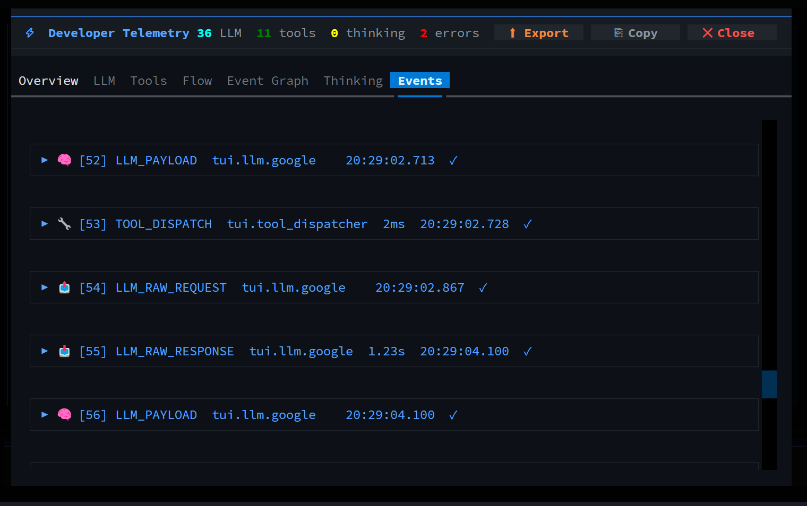</td>
    <td>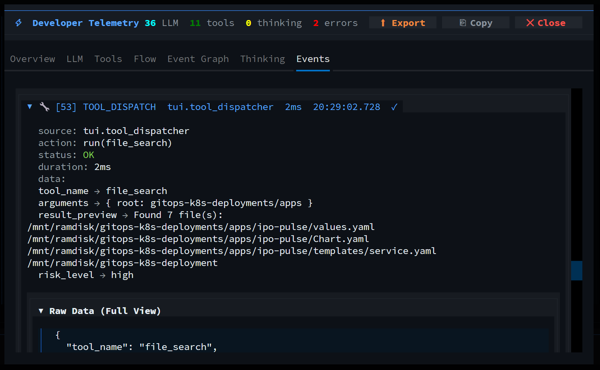</td>
  </tr>
  <tr>
    <td>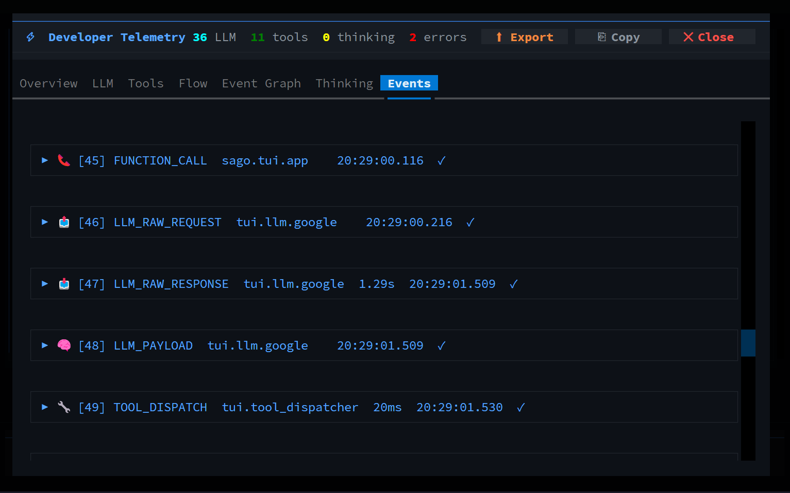</td>
    <td>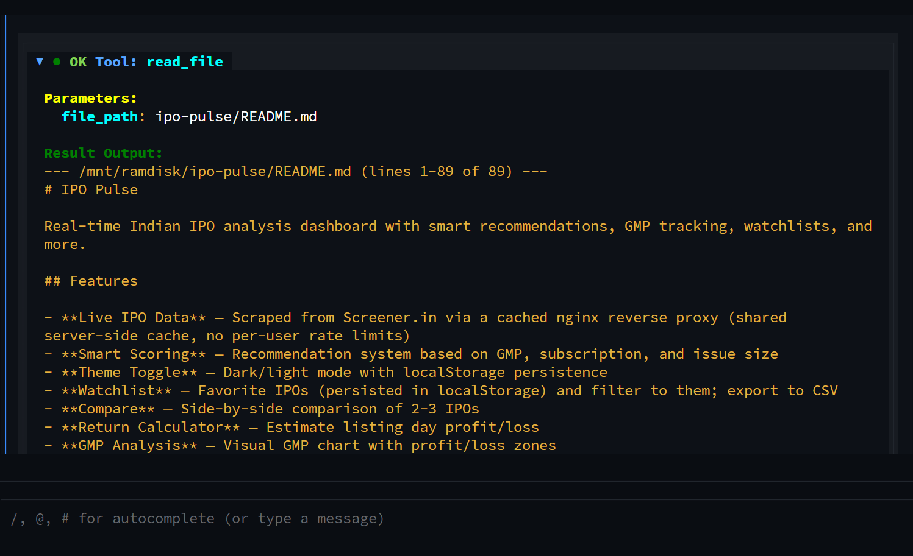</td>
  </tr>
</table>

Sessions are automatically saved to SQLite (`~/.sago/data/sago.db`) with write-ahead logging (WAL mode) and can be exported to JSON or Markdown.

```bash
# Save current session
/save my-session

# List saved sessions
/sessions

# Load a session
/load my-session

# Export conversation to markdown
/export

# Compact context (summarize old turns with 3-tiered memory pyramid)
/compact
```

---

## Deep Dive: Key Architectural Features

### 1. Atomic Checkpoints, Workspace Snapshots & 1-Click Rollback

Before executing multi-file edits or risky refactoring prompts, SAGO’s `CheckpointManager` takes atomic copy-on-write snapshots:

```bash
# Create a manual checkpoint before a large refactor
/checkpoint create "Refactor auth middleware to JWT"

# List all available checkpoints in current session
/checkpoint list

# Instantly restore workspace to a previous checkpoint
/checkpoint restore chk_1700000000

# Granular undo: revert only the changes from the latest assistant turn
/undo

# View chronological file modification audit trail
/changes
```

- **How it works**: SHA-256 hashes each touched file before modification and archives the base content in `.sago/checkpoints/`. If an agent introduces unwanted changes, `/checkpoint restore <id>` restores the exact file tree in milliseconds.

---

### 2. Multi-Agent Swarm, Instant `@` Mentions & Model Inheritance

SAGO coordinates **339 specialist agents** across 22 domains with dynamic runtime model and provider inheritance:

```bash
# Instant @ autocompletion: type @ to open live specialist recommendations
@python-engineer optimize the database connection pool in sago/database.py

# Delegate to a specialist agent (inherits your active LLM and provider)
/delegate system-architect Design the microservice boundaries
@delegate backend-engineer Implement the FastAPI routes

# Sequential multi-agent chaining: pass structured handoffs between agents
/chain system-architect,backend-engineer,code-reviewer Build a secure webhook receiver

# Run agents in parallel on the same objective
/parallel security-auditor,performance-engineer Audit the payment checkout flow
```

- **Model & Key Inheritance**: When delegating to subagents or running swarms, child agents dynamically inherit the user's active LLM provider (e.g. Gemini, OpenAI, Claude, OpenRouter), active model, and API keys via `resolve_active_llm_config()`.
- **Adding a new AI provider is one step**: register a declarative `ProviderSpec` in `sago/llm/registry.py` (name/aliases, env key, default model, base URL) — key resolution, `/model` + `/provider` handling, autocomplete, fallback chains and error hints all pick it up automatically.

---

### 3. Smart Project & AST Symbol Graph

Generate deep system architecture box diagrams, process execution maps, and entity models directly in the terminal:

```bash
# Interactive full system architecture dashboard
sago project-graph
/graph

# Layered System Architecture Box Diagram (Presentation, Orchestration, Agents, Memory, Mesh)
sago project-graph --view arch
/graph arch

# Autonomous Execution Pipeline & Flywheel Map
sago project-graph --view process
/graph process

# Entity-Relationship & Core Data Models (Pydantic, SQLAlchemy, Tortoise, SQL)
sago project-graph --view er
/graph er

# Terminal-native component connection flowchart
sago project-graph --view flow
/graph flow

# Real LLM AI architectural review & recommendations
sago project-graph --view llm
/graph ai
```

---

### 4. Hybrid BM25 + Dense Semantic Code Search

Search 1,000+ codebase files using zero-dependency local 128-dimensional dense vector embeddings combined with probabilistic BM25 ranking:

```bash
# Natural language semantic query
sago search "Where are database models and session tables defined?"

# Search in TUI
/search "JWT token verification handler"

# Generate AST-parsed symbol repository map (classes, functions, signatures)
sago map --query UserService
/map
```

---

### 5. Continuous Background Linting & Self-Healing Diagnostics

Non-blocking background verifier automatically checks written code in real time:

- **Virtualenv-Aware**: Automatically resolves `.venv/bin/*`, `uv run`, `poetry run`, and active system toolchains.
- **Multi-Language**: Supports Python (`ruff`, `pytest`, `mypy`), TypeScript/JavaScript (`tsc`), Rust (`cargo check`), and Go (`go vet`).
- **Self-Healing Loop**: Feeds compile errors and diagnostic line numbers directly back into the agent's context for autonomous error correction.

---

### 6. Hallucination Detection & Response Verification

Multi-layer defense-in-depth system prevents LLM fabrication across all execution paths:

- **Shared Verifier Module** (`sago/engine/hallucination_verifier.py`): 9-stage verification pipeline used by all execution paths (simple_executor, unified streaming, orchestrator, production).
- **Fabrication Phrase Detection**: 80+ patterns detect common LLM lies ("I've verified", "tests pass", "all tests pass") with tool-category cross-referencing.
- **Hedging/Subtle Claim Detection**: Catches unverifiable claims like "this should work", "trust me", "no breaking changes" without tool evidence.
- **Claim vs Tool-History Verification**: Cross-references claims (read, write, search, analyze, execute) against actual tool calls made.
- **Multi-Language Code Block Validation**: Brace matching and syntax checking for 15+ languages (Python, JS, TS, Go, Rust, Java, C, C++, C#, Ruby, PHP, Kotlin, Swift, Scala, Dart, Shell).
- **External Syntax Checking**: Subprocess verification via `py_compile`, `gofmt`, `rustfmt`, `node --check`, `npx tsc`, `javac`, `gcc -fsyntax-only`, `bash -n`, `ruby -c`, `php -l`, `ktlint`, `swiftc -parse`, `scalac`.
- **Tool Result Integrity**: SHA-256 hashing detects plugin tampering of tool results.
- **Confidence Scoring**: 0-100 score based on tool usage, fabrication signals, hedging claims, and code validity.
- **Response Sanitization**: Strips hallucinated sentences from output when confidence is low.
- **User Mention Detection**: Flags fabricated claims about files "you mentioned" that were never stated.

---

### 7. Detach Mode & Background Worker Daemon

Launch long-running jobs or multi-agent workflows and safely close your terminal:

```bash
# Spawn a CLI task into background daemon worker
sago run "Run complete test suite and benchmarks" --detach

# Detach from interactive TUI session without terminating ongoing agent tasks
/detach

# List running background tasks and detached sessions
sago attach

# Reattach to an interactive session or stream background task logs
sago attach a62c0922
sago attach task_1700000000
```

---

### 8. Developer Diagnostics & OpenTelemetry Export

Inspect internal function latencies, prompt payloads, and microsecond traces:

<table>
  <tr>
    <td>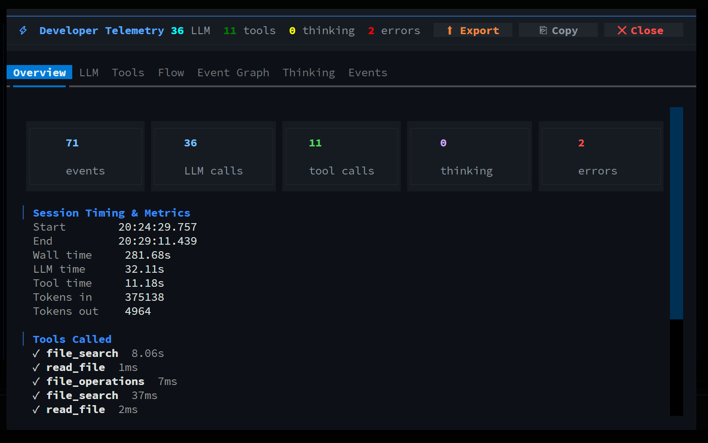</td>
    <td>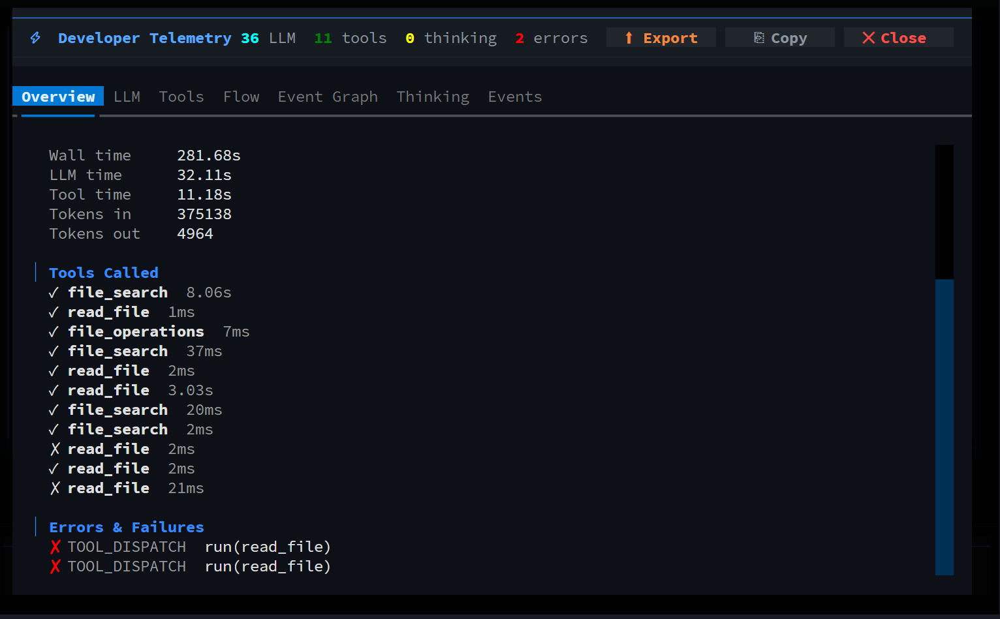</td>
  </tr>
  <tr>
    <td>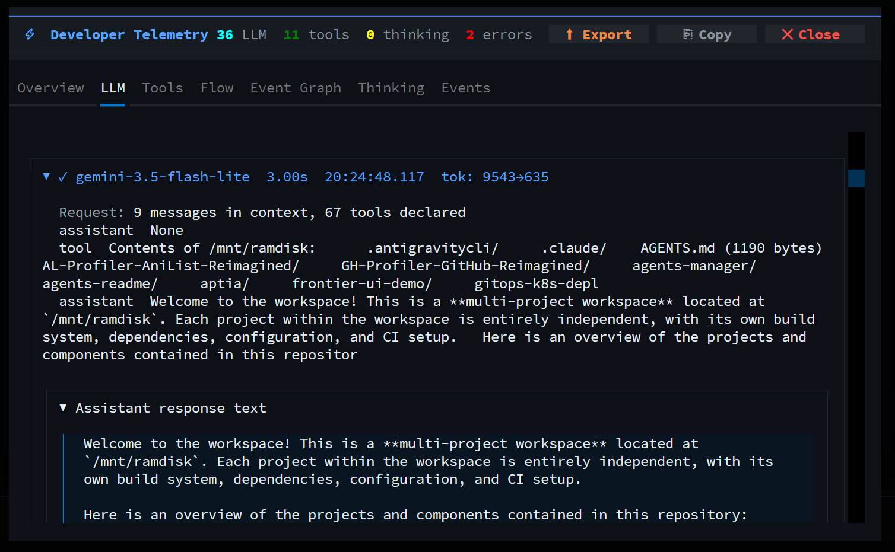</td>
    <td></td>
  </tr>
  <tr>
    <td>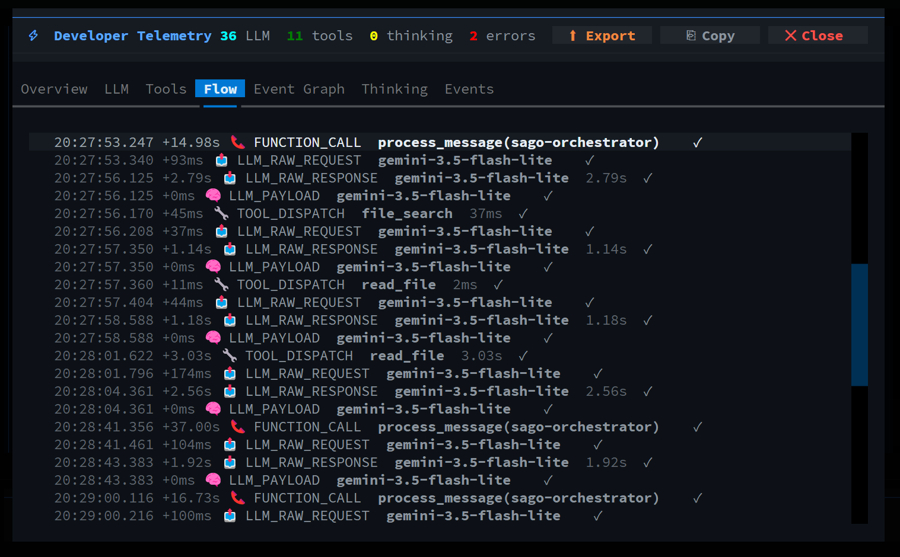</td>
    <td>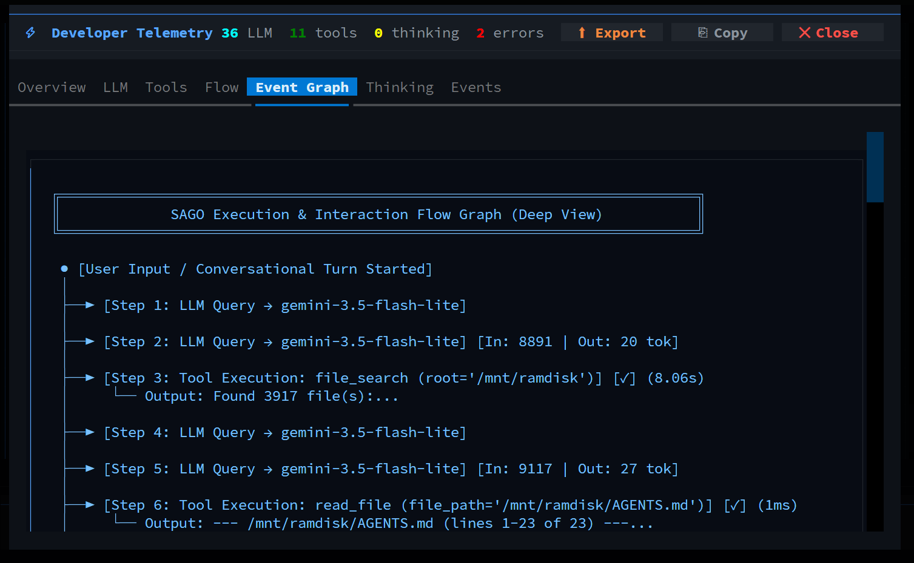</td>
  </tr>
</table>

```bash
# Toggle Developer Mode in TUI
/dev on

# Stream live function execution logs and LLM durations
/dev logs
/dev traces

# Export traces to standard OpenTelemetry (OTel) JSON or Prometheus metrics
/dev export otel
/dev export prometheus
sago telemetry --export otel --output traces.json
```

---

## Token Usage & Cost Tracking

```bash
# In TUI
/cost

# From CLI
sago usage
```

Output includes:
- Total input/output tokens
- Cache hit/miss counts and savings percentage
- Per-model cost breakdown (9 models supported)
- Session-level and cumulative tracking

---

## Workflow Engine

Create stateful, multi-step automations:

```bash
# Create a workflow
sago workflow-create "Deploy Pipeline"

# Add steps with dependencies
sago workflow-add-step <id> --name "Test" --type agent_call --config '{"task": "Run tests"}'
sago workflow-add-step <id> --name "Build" --type tool_call --config '{"tool": "execute_shell", "args": {"command": "make build"}}' --depends-on test-step
sago workflow-add-step <id> --name "Deploy" --type agent_call --config '{"task": "Deploy to production"}' --depends-on build-step

# Execute
sago workflow-run <id>

# Stream execution
sago workflow-run <id> --stream
```

---

## Architecture

See [docs/PROJECT.md](docs/PROJECT.md) for detailed project structure. MCP server documented in [docs/MCP.md](docs/MCP.md).

```
sago/
├── agents/              # 339 agent profiles
│   ├── profiles/        # One .py per agent with metadata
│   ├── registry.py      # Agent loading and lookup
│   ├── spawner.py       # Agent execution with feedback loops
│   └── handoff.py       # HandoffContext, RecursionGuard, FeedbackRequest
├── tools/               # 70 production tools
│   ├── base.py          # BaseTool with permission checks
│   ├── file/            # File operations (12 tools)
│   ├── shell/           # Shell execution
│   ├── network/         # HTTP, DNS, crawling
│   ├── coding/          # Code analysis, debugging
│   ├── ssh/             # SSH operations
│   ├── system/          # Git, Docker, env
│   └── admin/           # Sudo, permissions
├── engine/              # Execution engines
│   ├── simple_executor.py   # Smart executor with auto-discovery
│   └── unified.py           # Unified executor (simple/crewai/langgraph)
├── permissions.py       # Risk-based permission system
├── workflow/            # Workflow engine
│   ├── engine.py        # Stateful workflows with dependencies
│   └── langgraph_engine.py  # LangGraph integration
├── server/              # TCP daemon server
│   └── daemon.py        # Background daemon with client
├── mcp/                 # Model Context Protocol
│   └── server.py        # MCP server with 70+ tools
├── tui/                 # Terminal UI
│   ├── app.py           # Textual TUI with dashboard
│   ├── widgets/         # AgentDashboard, AgentSpinner, HandoffFlow
│   ├── helpers.py       # Agent-tagged message rendering
│   └── smart_input.py   # Input processor
├── llm/                 # LLM providers
│   ├── registry.py      # Provider registry — add a provider with ONE ProviderSpec
│   ├── openai_provider.py
│   ├── openrouter.py
│   ├── gemini.py
│   └── claude.py
├── memory/              # Memory and context
│   ├── rag.py           # RAG memory with search
│   ├── compaction.py    # Session compaction
│   └── profiles.py      # User profiles
├── cache/               # Intelligent caching
│   └── intelligent.py   # Content-hash cache with TTL/LRU
├── tracking/            # Usage tracking
│   └── token_tracker.py # Token counting and cost
├── sessions/            # Session management
│   └── manager.py       # Multi-session with parallel execution
├── errors/              # Error handling
│   └── handler.py       # Recovery with fallback tools
├── database.py          # SQLite persistence
├── paths.py             # Cross-platform paths
├── config/              # Configuration
│   ├── loader.py
│   ├── project_config.py
│   └── sago.yaml
└── main.py              # CLI entry point
```

---

## Quality

Sago includes comprehensive coverage across unit, integration, and security categories.

**645 tests passed**, 1 skipped. See [docs/ERRORS.md](docs/ERRORS.md) for error handling and [docs/FLOWS.md](docs/FLOWS.md) for system flowcharts.

### Quality Areas

| Category | Coverage |
|----------|----------|
| Unit - Tools | All 57+ tools with proper arguments |
| Unit - Dynamic Topology Graph & Cache | Dynamic project title, execution lifecycle maps, and cross-session disk cache |
| Unit - Semantic Intent Classifier | Micro-LLM intent detection, LRU cache & conversational classification |
| Unit - Hybrid Indexer & BM25 | BM25 probabilistic ranking & dense semantic vector similarity |
| Unit - Continuous Verifier | Background non-blocking verification queue & diagnostic extraction |
| Unit - OpenTelemetry & Prometheus | OTel Trace JSON specification & Prometheus exposition format |
| Unit - Memory Pyramids & Deltas | 3-tiered memory hierarchy & zero-redundancy handoff state deltas |
| Unit - Permissions | Risk levels, blocking, approval workflow |
| Unit - Agents | Registry, profiles, lookup |
| Integration - Executor | Tool discovery, task detection, extraction |
| Integration - Server | Daemon, client, protocol |
| Integration - Workflow | Engine, steps, dependencies |
| Integration - MCP | Server, tools, creation |
| Security | Path traversal, injection, bypass, validation |

---

## Security

### Path Traversal Protection
- Tools validate file paths before execution
- Blocked paths configurable per project

### Command Injection Protection
- Shell commands validated before execution
- Permission system blocks dangerous operations

### Permission Bypass Prevention
- High/critical risk tools require explicit approval
- Session-isolated approval state
- Blocked tools cannot be executed even with valid credentials

### Input Validation
- Empty/None inputs handled gracefully
- Special characters sanitized
- Error messages don't expose internals

### Sensitive Data Filtering
- API keys never exposed in tool output
- Passwords filtered from system info

---

## LLM Providers

| Provider | Models | API Key | Streaming |
|----------|--------|---------|-----------|
| OpenRouter | Multiple models | `OPENROUTER_API_KEY` | Yes |
| OpenAI | gpt-4o, gpt-4o-mini | `OPENAI_API_KEY` | Yes |
| Gemini | gemini-2.0-flash, gemini-1.5-pro | `GEMINI_API_KEY` | Yes |
| Claude | claude-3-5-sonnet, claude-3-haiku | `ANTHROPIC_API_KEY` | Yes |
| Ollama | Local models | None required | Yes |

### Effort Levels

| Level | Max Tokens | Max Iterations | Use Case |
|-------|-----------|----------------|----------|
| Low | 8,192 | 3 | Quick fixes, typos |
| Medium | 16,384 | 5 | Standard tasks |
| High | 32,768 | 8 | Complex architecture |
| Max | 65,536 | 12 | Critical systems |

---

## Configuration

### Project Config

After `sago init`, edit `config.sago.json`:

```json
{
  "agents": {
    "python-engineer": {
      "enabled": true,
      "system_prompt_override": "Custom prompt...",
      "tools_add": ["web_crawler"],
      "temperature": 0.8
    }
  },
  "permissions": {
    "allow_shell_execute": true,
    "allow_ssh": false,
    "blocked_paths": ["/etc", "/sys"]
  }
}
```

### Global Storage & Maintenance

Stored in `~/.sago/`:

```
~/.sago/
├── data/sago.db          # SQLite database (sessions, messages, tool metrics)
├── cache/                # Fast regenerable caches (hybrid index BM25, AST graphs)
├── backups/              # Auto-pruned incremental file edit backups
├── permissions.json      # Tool permissions
├── sessions/             # Saved sessions (JSON/Markdown exports)
└── config.yaml           # Global configuration
```

### Garbage Collection & Cleanup

Sago includes an integrated garbage collection engine to safely purge regenerable search caches, older file edit backups, stale workspace snapshots, and empty/noise database sessions while defragmenting SQLite via `VACUUM`:

```bash
# Clean all stale items (default: caches, backups, checkpoints, empty DB sessions, logs)
sago clean

# Preview what would be cleaned without deleting files
sago clean --dry-run

# Targeted cleanup operations
sago clean --cache              # Purge hybrid index & AST graph caches
sago clean --backups            # Clean stale file edit backups
sago clean --checkpoints        # Prune old workspace snapshots (keep newest 3)
sago clean --db                 # Purge empty sessions & VACUUM database
sago clean --days 7             # Purge items older than 7 days
sago clean --keep-backups 5     # Retain only the 5 most recent session backups

# In the interactive TUI:
/clean                          # Run full cleanup directly within the session
/clean cache                    # Purge search & graph caches
/checkpoint prune 3             # Prune old workspace checkpoints
```

---

## CI/CD

GitHub Actions pipeline runs on every push:

1. **Lint** — Ruff code quality
2. **Type Check** — MyPy static analysis
3. **Unit Tests** — Tool, permission, agent tests
4. **Integration Tests** — Executor, server, workflow tests
5. **Security Tests** — Vulnerability checks
6. **Build** — Package build verification

See `.github/workflows/ci.yml` for details.

---

## Contributing

1. Fork the repository
2. Create a feature branch (`git checkout -b feature/amazing`)
3. Make your changes
4. Ensure code quality with linting
5. Submit a pull request

### Development Setup

```bash
git clone https://github.com/SAGO-AUTOMATES/SAGO-Agent.git
cd SAGO-Agent
pip install -e ".[dev]"
```

---

## Documentation

| Document | Description |
|----------|-------------|
| [docs/BUILD.md](docs/BUILD.md) | Build and installation instructions |
| [docs/COMMANDS.md](docs/COMMANDS.md) | CLI and TUI command reference |
| [docs/TUI_CHAT_STRUCTURE.md](docs/TUI_CHAT_STRUCTURE.md) | TUI message flow — systematic `thinking→tool` order, per-agent headers, DB persistence, reload, Inspector, chain/parallel/delegate handling (caps, canonical) |
| [docs/TOOLS.md](docs/TOOLS.md) | All 73 tools with examples |
| [docs/ERRORS.md](docs/ERRORS.md) | Error handling and recovery |
| [docs/MCP.md](docs/MCP.md) | MCP server integration |
| [docs/PROJECT.md](docs/PROJECT.md) | Project structure and architecture |
| [docs/DEVELOPER_MODE.md](docs/DEVELOPER_MODE.md) | Developer mode — now **default ON until 1.0** (`TODO: flip to false at 1.0`) |
| [docs/ARCHITECTURE.md](docs/ARCHITECTURE.md) | High-level architecture + systematic order + summary by agent |

---

## License

GPL-3.0 - see [LICENSE](LICENSE) for details.

---

**Sago** — Because every task deserves the perfect agent.
