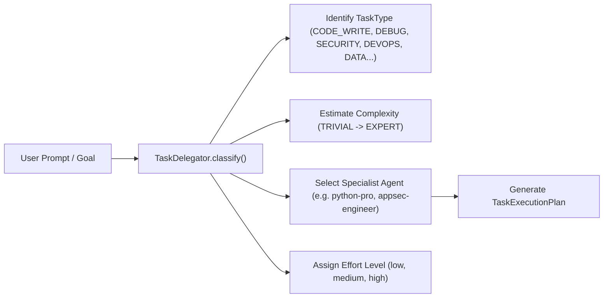

# SAGO System Architecture & Execution Flows

> Comprehensive technical guide to SAGO's internal workflows: Vector DB & RAG Memory, Database Persistence, 5-Layer Failure Prevention, Multi-Agent Swarm Orchestration, Dynamic Task Delegation, Autonomous Tool Execution, Self-Healing Verification, and Detached Background Workers.

---

## Table of Contents

1. [High-Level System Topology](#1-high-level-system-topology)
2. [Database Structure & Persistence Engine](#2-database-structure--persistence-engine)
3. [5-Layer Smart Failure Prevention Matrix](#3-5-layer-smart-failure-prevention-matrix)
4. [Vector DB, RAG & Context Providers](#4-vector-db-rag--context-providers)
5. [Multi-Agent Swarm & Dynamic Delegation Engine](#5-multi-agent-swarm--dynamic-delegation-engine)
6. [Multi-Agent Execution Modes](#6-multi-agent-execution-modes)
7. [Typed Context Handoffs & Recursion Protection](#7-typed-context-handoffs--recursion-protection)
8. [Tool Matrix & Risk-Gated Permission Model](#8-tool-matrix--risk-gated-permission-model)
9. [Self-Healing Verification Flywheel](#9-self-healing-verification-flywheel)
10. [Atomic Checkpoints & Workspace Snapshotting](#10-atomic-checkpoints--workspace-snapshotting)
11. [Daemon & Detach Mode Background Workers](#11-daemon--detach-mode-background-workers)
12. [Distributed Peer Mesh Network](#12-distributed-peer-mesh-network)

---

## 1. High-Level System Topology

SAGO is engineered as an autonomous, multi-layered agentic operating system designed to handle complex software engineering workflows without human micromanagement.


---

## 2. Database Structure & Persistence Engine

Implemented in [`sago/database.py`](file:///mnt/ramdisk/sago/sago/database.py), SAGO uses an embedded, high-performance SQLite engine with write-ahead logging (WAL) and thread-isolated connection pooling.

```text
┌────────────────────────────────────────────────────────────────────────┐
│                        SQLite Persistent Core                          │
│        (Thread-Isolated Connection Pool • WAL Mode Enabled)            │
├─────────────────┬──────────────────┬─────────────────┬─────────────────┤
│  sessions table │  messages table  │   tasks table   │tool_usage table │
│ • id (UUID)     │ • id & role      │ • id & chain    │ • tool name     │
│ • title & status│ • content & token│ • circular guard│ • success/error │
│ • created_at    │ • batch flushed  │ • status & deps │ • latency & args│
└─────────────────┴──────────────────┴─────────────────┴─────────────────┘
```

### Key Database Subsystems:
* **Thread-Isolated Connection Pooling (`ConnectionPool`)**: Eliminates SQLite concurrency locks during parallel multi-agent swarms by assigning isolated connections per thread.
* **Buffered Message Store (`MessageStore`)**: Queues conversation turns in memory and writes them in atomic disk transactions, preventing I/O stalls during high-speed streaming.
* **Task Store with Circular Graph Guard (`TaskStore`)**: Tracks hierarchical subtasks and prevents circular dependency deadlocks when agents dynamically schedule prerequisite tasks.
* **Tool Usage Analytics (`ToolUsageStore`)**: Records tool invocation latencies, arguments, error counts, and success rates.

---

## 3. 5-Layer Smart Failure Prevention Matrix

SAGO employs a 5-layer defensive safety matrix to ensure autonomous execution never damages a project or enters infinite loops:

| Safety Layer | Implementation Module | Defensive Mechanism |
| :--- | :--- | :--- |
| **1. Atomic Checkpoints** | [`sago/engine/checkpoint.py`](file:///mnt/ramdisk/sago/sago/engine/checkpoint.py) | Takes lightweight copy-on-write workspace snapshots before high-risk changes. Enables **1-click instant rollback** (`/checkpoint restore <id>`). |
| **2. Self-Healing Verifier** | [`sago/engine/verifier.py`](file:///mnt/ramdisk/sago/sago/engine/verifier.py) | Automatically resolves `.venv/bin/*`, `uv run`, `pytest`, `ruff`, `tsc`, `cargo`, and `go vet`. Captures compiler errors and feeds them directly back to agents for autonomous correction. |
| **3. Recursion & Loop Guards** | [`sago/orchestrator/delegator.py`](file:///mnt/ramdisk/sago/sago/orchestrator/delegator.py) | Enforces maximum delegation depth (`max_depth = 5`) and tracks a `visited_agents` set to block circular ping-pong loops between agents. |
| **4. Persistent Learning Store** | [`sago/memory/learning_store.py`](file:///mnt/ramdisk/sago/sago/memory/learning_store.py) | Persists proven error fixes and successful strategies across sessions. When an error recurs, `get_known_fixes()` instantly suggests the verified fix. |
| **5. Risk-Gated Permissions** | [`sago/permissions.py`](file:///mnt/ramdisk/sago/sago/permissions.py) | Enforces granular risk policies (`SAFE`, `LOW`, `MEDIUM`, `HIGH`, `CRITICAL`) with path traversal guards, secret leak detection, and shell sanitization. |

---

## 4. Vector DB, RAG & Context Providers

SAGO uses three complementary context providers in [`sago/memory/`](file:///mnt/ramdisk/sago/sago/memory/) to supply agents with exact workspace context while preventing context-window blowout.

```text
               ┌────────────────────────────────────────────────┐
               │              Active User Request               │
               └───────────────────────┬────────────────────────┘
                                       │
     ┌─────────────────────────────────┼─────────────────────────────────┐
     │                                 │                                 │
     ▼                                 ▼                                 ▼
┌─────────────────────────┐ ┌─────────────────────────┐ ┌─────────────────────────┐
│ AST Symbol Graph & Maps │ │  ChromaDB Vector RAG    │ │ Semantic Context        │
│ (Zero-Token Topology)   │ │ (Sliding-Window Chunks) │ │ Compactor (Turn Pruning)│
├─────────────────────────┤ ├─────────────────────────┤ ├─────────────────────────┤
│ • Classes, interfaces   │ │ • Overlapping code block│ │ • Prunes verbose tools  │
│ • Function signatures   │ │ • Dense neural embed    │ │ • Preserves file diffs  │
│ • DB entity models (ER) │ │ • Cosine + recency rank │ │ • Retains active todos  │
└────────────┬────────────┘ └────────────┬────────────┘ └────────────┬────────────┘
             │                           │                           │
             └───────────────────────────┼───────────────────────────┘
                                         │
                                         ▼
                         ┌───────────────────────────────┐
                         │ Assembled High-Density Prompt │
                         └───────────────────────────────┘
```

1. **AST Structural Graph Provider (`ProjectGraph` & `SymbolGraph`)**:
   * Analyzes multi-language ASTs (Python, TypeScript, Rust, Go, SQL, C++) to inject high-level signatures, ER schemas, and file hierarchies directly into prompt headers.
2. **Dense Neural Vector Search (`RAGMemory` & `CodebaseIndexer`)**:
   * Slices files into overlapping sliding-window semantic blocks in ChromaDB and ranks results by cosine similarity and importance weights.
3. **Hierarchical Context Compactor (`sago/memory/compaction.py`)**:
   * Compresses long multi-turn sessions (30+ turns), stripping raw compiler dumps and terminal outputs while retaining architectural decisions and active todos.

---

## 5. Multi-Agent Swarm & Dynamic Delegation Engine

SAGO houses **339 specialized agents** classified into **22 functional engineering domains**. Orchestration is managed dynamically by `TaskDelegator` ([`sago/orchestrator/delegator.py`](file:///mnt/ramdisk/sago/sago/orchestrator/delegator.py)) and the Unified Orchestrator ([`sago/engine/unified.py`](file:///mnt/ramdisk/sago/sago/engine/unified.py)).

### Dynamic Intent Routing & Classification



---

## 6. Multi-Agent Execution Modes

SAGO provides four distinct orchestration execution paradigms:

```text
1. DIRECT DELEGATION (/delegate <agent> <task>)
   User ──► Master Orchestrator ──► Specialist Agent ──► Result

2. SEQUENTIAL AGENT CHAINING (/chain <agent1,agent2,agent3> <task>)
   User ──► [ System Architect ]
                  │ (Spec & Design)
                  ▼
            [ Backend Engineer ]
                  │ (Code Implementation)
                  ▼
            [ Code Reviewer ] ──► Verified Result

3. PARALLEL AGENT SWARM (/parallel <agent1,agent2> <task>)
   User ──► Dispatcher ──┬──► [ Security Auditor ]   (Thread 1) ──┐
                         ├──► [ Performance Engineer] (Thread 2) ──┼──► Aggregate Report
                         └──► [ Test Engineer ]       (Thread 3) ──┘

4. STATEFUL WORKFLOW ENGINE (sago workflow "<task>")
   State Graph (LangGraph) with Checkpoints, Retries, Condition Nodes & Resumption
```

---

## 7. Typed Context Handoffs & Recursion Protection

To allow seamless collaboration between agents without data loss or infinite loops, SAGO enforces strict handoff protocols:

* **Recursion Guard**: Tracks current delegation depth (`max_depth = 5`). If an agent attempts to delegate beyond the limit, the system gracefully handles the request locally.
* **Cycle & Loop Detection**: Tracks visited agents in a chain. If Agent A calls Agent B, Agent B cannot call Agent A unless explicitly flagged as a feedback loop.
* **Typed State Handoffs**: Passes structured context metadata including created files, active diffs, lint diagnostics, and test outcomes.

---

## 8. Tool Matrix & Risk-Gated Permission Model

Agents interact with the environment via **56+ production tools** registered under `sago/tools/`. Every tool execution is evaluated by the **Permission Manager** ([`sago/permissions.py`](file:///mnt/ramdisk/sago/sago/permissions.py)):

| Risk Level | Operations Included | Security Policy |
| :--- | :--- | :--- |
| **`SAFE`** | Read file, AST symbol lookup, grep search, project graph, list directory | Automatically executed without prompt |
| **`LOW`** | Web search, token cost estimation, lint diagnostics | Auto-allowed with audit log |
| **`MEDIUM`** | Write file, edit file content, create directory | Monitored file diff tracking |
| **`HIGH`** | Bash command execution, package installation (`pip`, `npm`, `cargo`) | User confirmation prompt (or `/yolo` mode) |
| **`CRITICAL`**| Destructive filesystem commands (`rm -rf`), Git force pushes, remote SSH execution | Strict confirmation modal with explicit warnings |

---

## 9. Self-Healing Verification Flywheel

When agents edit code, SAGO automatically runs a background verification loop ([`sago/engine/verifier.py`](file:///mnt/ramdisk/sago/sago/engine/verifier.py)):

```text
                  ┌──────────────────────────────┐
                  │    Agent Writes / Modifies   │
                  │         Code Files           │
                  └──────────────┬───────────────┘
                                 │
                                 ▼
                  ┌──────────────────────────────┐
                  │  Virtualenv-Aware Verifier   │
                  │  Auto-resolves .venv/bin/*,  │
                  │  ruff, pytest, mypy, tsc,    │
                  │  cargo check, go vet         │
                  └──────────────┬───────────────┘
                                 │
                 ┌───────────────┴───────────────┐
                 │                               │
                 ▼                               ▼
       [ ✅ Checks Passed ]            [ ❌ Errors / Lints Found ]
                 │                               │
                 ▼                               ▼
      ┌─────────────────────┐         ┌─────────────────────┐
      │ Commit Workspace &  │         │ Auto-Feed Compiler  │
      │ Stream Success      │         │ Diagnostics back to │
      │                     │         │ Agent Loop to Fix   │
      └─────────────────────┘         └──────────┬──────────┘
                                                 │
                                                 └─► Loop back to Step 1
```

---

## 10. Atomic Checkpoints & Workspace Snapshotting

Before executing high-impact multi-file refactors, SAGO's `CheckpointManager` ([`sago/engine/checkpoint.py`](file:///mnt/ramdisk/sago/sago/engine/checkpoint.py)) takes lightweight atomic snapshots of workspace deltas:

* **Automatic Snapshots**: Triggered before high-risk agent operations.
* **1-Click Rollback (`/checkpoint restore <id>`)**: Reverts modified files back to the exact pre-task state if an agent makes undesirable changes.
* **Zero Overhead**: Uses file hashing and copy-on-write delta storage in `.sago/checkpoints/`.

---

## 11. Daemon & Detach Mode Background Workers

SAGO supports non-blocking detached execution across both CLI and TUI:

```text
1. DETACHED EXECUTION (CLI)
   $ sago run "Run integration test suite" --detach
   ↳ Spawns detached background worker (PID / Daemon)
   ↳ Outputs Task ID and log path (.sago/logs/task_xxx.log)
   ↳ Safe to immediately close the terminal tab

2. REATTACHING ANYTIME (CLI / TUI)
   $ sago attach
   ↳ Displays active sessions and background task logs
   $ sago attach task_xxx
   ↳ Live-tails streaming log (Ctrl+C cleanly detaches again)
   $ sago attach session_id
   ↳ Resumes interactive TUI session directly
```

---

## 12. Distributed Peer Mesh Network

SAGO instances can form local and remote clusters for distributed task distribution:

* **Local Subnet Discovery**: Broadcasts heartbeat pings over UDP port `7654` to auto-discover neighbor SAGO agents on the local network.
* **Daemon Socket / HTTP Mesh (`sago/server/daemon.py`)**: Accepts remote task executions (`sago remote "task" --host <ip>`) and streams responses over Unix sockets or TCP.
