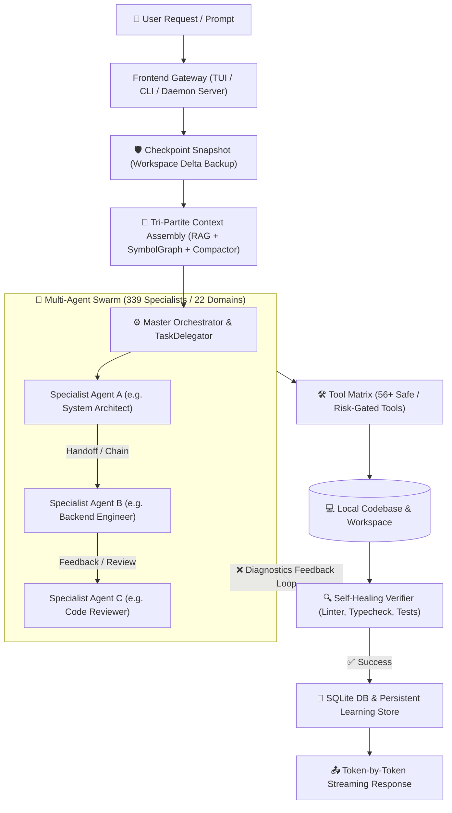
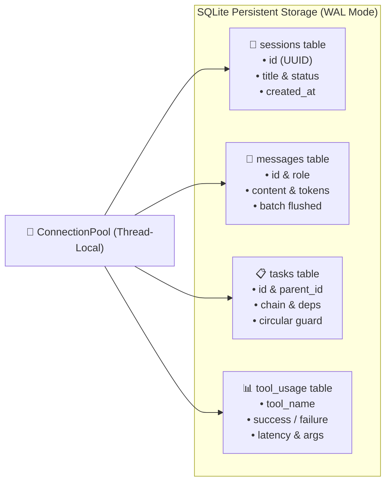
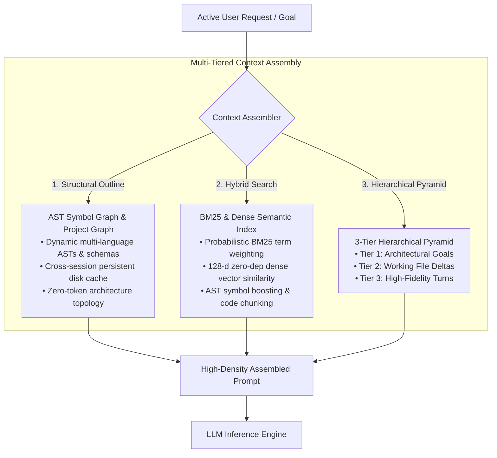
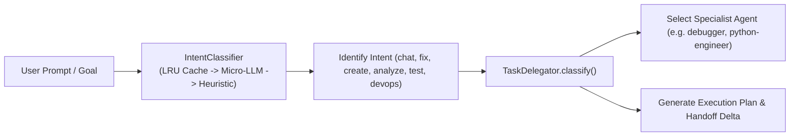
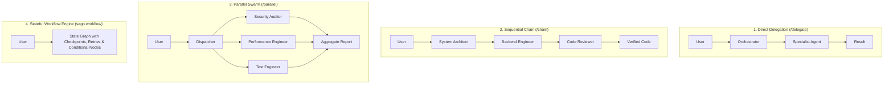
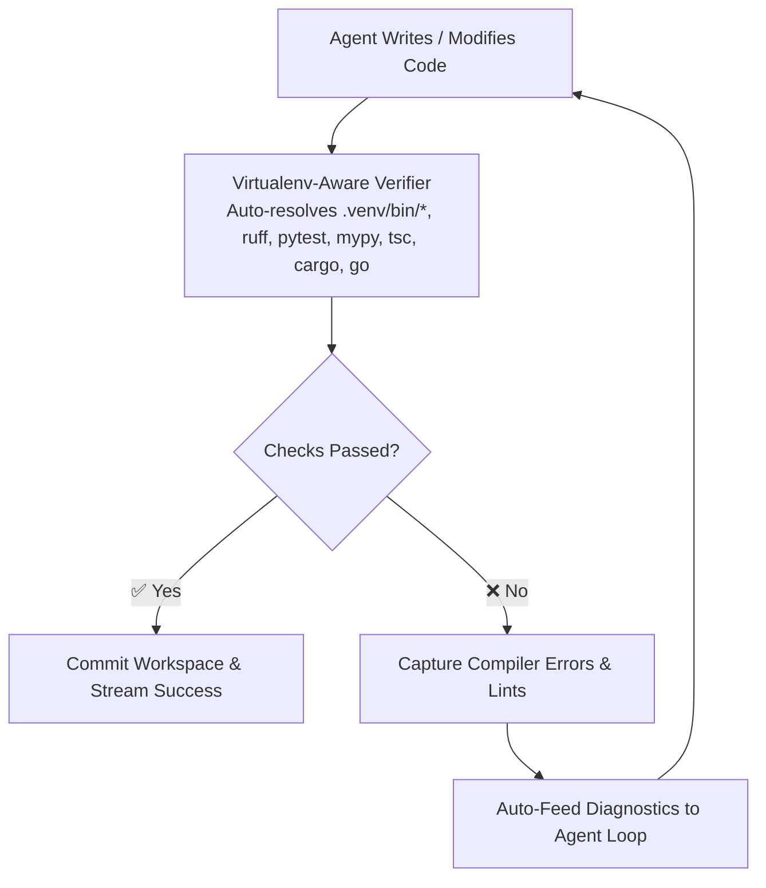
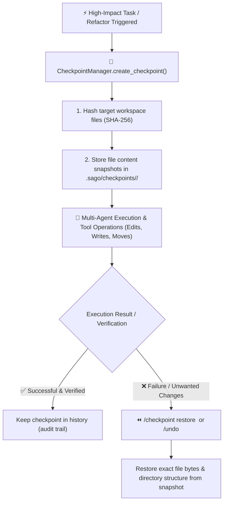
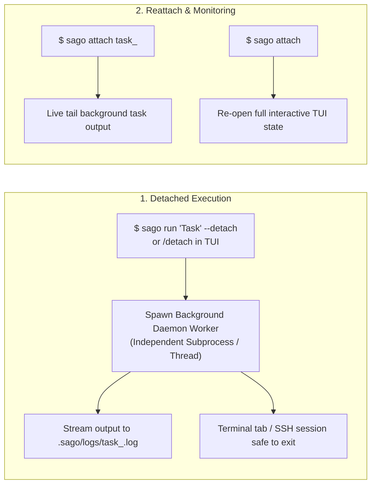
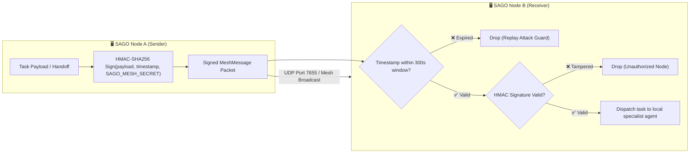

# SAGO System Architecture & Execution Flows

> Comprehensive technical guide to SAGO's internal workflows: Vector DB & RAG Memory, Database Persistence, 5-Layer Failure Prevention, Multi-Agent Swarm Orchestration, Dynamic Task Delegation, Autonomous Tool Execution, Self-Healing Verification, and Detached Background Workers.

---

## Table of Contents

1. [High-Level System Topology](#1-high-level-system-topology)
2. [Database Structure & Persistence Engine](#2-database-structure--persistence-engine)
3. [5-Layer Smart Failure Prevention Matrix](#3-5-layer-smart-failure-prevention-matrix)
4. [Vector DB, RAG & Context Providers](#4-vector-db-rag--context-providers)
5. [Multi-Agent Swarm & Dynamic Delegation Engine](#5-multi-agent-swarm--dynamic-delegation-engine)
6. [Multi-Agent Execution Modes](#6-multi-agent-execution-modes)
7. [Typed Context Handoffs & Recursion Protection](#7-typed-context-handoffs--recursion-protection)
8. [Tool Matrix & Risk-Gated Permission Model](#8-tool-matrix--risk-gated-permission-model)
9. [Self-Healing Verification Flywheel](#9-self-healing-verification-flywheel)
10. [Atomic Checkpoints & Workspace Snapshotting](#10-atomic-checkpoints--workspace-snapshotting)
11. [Daemon & Detach Mode Background Workers](#11-daemon--detach-mode-background-workers)
12. [Distributed Peer Mesh Network](#12-distributed-peer-mesh-network)

---

## 1. High-Level System Topology

SAGO is engineered as an autonomous, multi-layered agentic operating system designed to handle complex software engineering workflows without human micromanagement.

---

## 2. Database Structure & Persistence Engine

Implemented in [`sago/database.py`](file:///mnt/ramdisk/sago/sago/database.py), SAGO uses an embedded, high-performance SQLite database with write-ahead logging (WAL mode) and thread-isolated connection pooling.

### Key Database Subsystems:
* **Thread-Isolated Connection Pooling (`ConnectionPool`)**: Eliminates SQLite concurrency locks during parallel multi-agent swarms by assigning isolated connections per thread.
* **Buffered Message Store (`MessageStore`)**: Queues conversation turns in memory and writes them in atomic disk transactions, preventing I/O stalls during high-speed streaming.
* **Task Store with Circular Graph Guard (`TaskStore`)**: Tracks hierarchical subtasks and prevents circular dependency deadlocks when agents dynamically schedule prerequisite tasks.
* **Tool Usage Analytics (`ToolUsageStore`)**: Records tool invocation latencies, arguments, error counts, and success rates.

---

## 3. 5-Layer Smart Failure Prevention Matrix

SAGO employs a 5-layer defensive safety matrix to ensure autonomous execution never damages a project or enters infinite loops:

| Safety Layer | Implementation Module | Defensive Mechanism |
| :--- | :--- | :--- |
| **1. Atomic Checkpoints** | [`sago/engine/checkpoint.py`](file:///mnt/ramdisk/sago/sago/engine/checkpoint.py) | Takes lightweight copy-on-write workspace snapshots before high-risk changes. Enables **1-click instant rollback** (`/checkpoint restore <id>`). |
| **2. Self-Healing Verifier** | [`sago/engine/verifier.py`](file:///mnt/ramdisk/sago/sago/engine/verifier.py) | Automatically resolves `.venv/bin/*`, `uv run`, `pytest`, `ruff`, `tsc`, `cargo`, and `go vet`. Captures compiler errors and feeds them directly back to agents for autonomous correction. |
| **3. Recursion & Loop Guards** | [`sago/orchestrator/delegator.py`](file:///mnt/ramdisk/sago/sago/orchestrator/delegator.py) | Enforces maximum delegation depth (`max_depth = 5`) and tracks a `visited_agents` set to block circular ping-pong loops between agents. |
| **4. Persistent Learning Store** | [`sago/memory/learning_store.py`](file:///mnt/ramdisk/sago/sago/memory/learning_store.py) | Persists proven error fixes and successful strategies across sessions. When an error recurs, `get_known_fixes()` instantly suggests the verified fix. |
| **5. Risk-Gated Permissions** | [`sago/permissions.py`](file:///mnt/ramdisk/sago/sago/permissions.py) | Enforces granular risk policies (`SAFE`, `LOW`, `MEDIUM`, `HIGH`, `CRITICAL`) with path traversal guards, secret leak detection, and shell sanitization. |

---

## 4. Vector DB, Hybrid BM25 & Context Providers

SAGO uses three complementary context providers in [`sago/memory/`](file:///mnt/ramdisk/sago/sago/memory/) to supply agents with exact workspace context while preventing context-window blowout.

1. **AST Structural Graph Provider (`ProjectGraph` & `SymbolGraph`)**:
   * Analyzes multi-language ASTs (Python, TypeScript, Rust, Go, SQL, C++) to inject high-level signatures, ER schemas, and file hierarchies directly into prompt headers with cross-session disk caching (`~/.sago/cache/project_graphs/`).
2. **Hybrid BM25 & Dense Semantic Vector Search (`HybridCodeIndexer` & `HybridSearchTool`)**:
   * Combines probabilistic BM25 rank scoring ($k_1=1.5, b=0.75$) with 128-dimensional dense sub-token vector hashing for sub-second semantic search across 1,000+ files without external cloud vector DBs.
3. **Hierarchical Context Compactor & Memory Pyramid (`HierarchicalMemoryPyramid` in `sago/memory/compaction.py`)**:
   * Maintains a 3-tier memory pyramid, saving ~70% token overhead and preventing context exhaustion during complex agent handoffs (`to_state_delta()`).

---

## 5. Multi-Agent Swarm & Dynamic Intent Classification

SAGO houses **339 specialized agents** classified into **22 functional engineering domains**. Intent routing is powered by the **Semantic Intent Classifier** ([`sago/engine/intent_classifier.py`](file:///mnt/ramdisk/sago/sago/engine/intent_classifier.py)) and `TaskDelegator` ([`sago/orchestrator/delegator.py`](file:///mnt/ramdisk/sago/sago/orchestrator/delegator.py)).

### Dynamic Intent Routing & Classification

---

## 6. Multi-Agent Execution Modes

SAGO provides four distinct orchestration execution paradigms:

---

## 7. Typed Context Handoffs & Recursion Protection

To allow seamless collaboration between agents without data loss or infinite loops, SAGO enforces strict handoff protocols:

* **Recursion Guard**: Tracks current delegation depth (`max_depth = 5`). If an agent attempts to delegate beyond the limit, the system gracefully handles the request locally.
* **Cycle & Loop Detection**: Tracks visited agents in a chain. If Agent A calls Agent B, Agent B cannot call Agent A unless explicitly flagged as a feedback loop.
* **Typed State Handoffs**: Passes structured context metadata including created files, active diffs, lint diagnostics, and test outcomes.

---

## 8. Tool Matrix & Risk-Gated Permission Model

Agents interact with the environment via **56+ production tools** registered under `sago/tools/`. Every tool execution is evaluated by the **Permission Manager** ([`sago/permissions.py`](file:///mnt/ramdisk/sago/sago/permissions.py)):

| Risk Level | Operations Included | Security Policy |
| :--- | :--- | :--- |
| **`SAFE`** | Read file, AST symbol lookup, grep search, project graph, list directory | Automatically executed without prompt |
| **`LOW`** | Web search, token cost estimation, lint diagnostics | Auto-allowed with audit log |
| **`MEDIUM`** | Write file, edit file content, create directory | Monitored file diff tracking |
| **`HIGH`** | Bash command execution, package installation (`pip`, `npm`, `cargo`) | User confirmation prompt (or `/yolo` mode) |
| **`CRITICAL`**| Destructive filesystem commands (`rm -rf`), Git force pushes, remote SSH execution | Strict confirmation modal with explicit warnings |

---

## 9. Self-Healing Verification Flywheel

When agents edit code, SAGO automatically runs a background verification loop ([`sago/engine/verifier.py`](file:///mnt/ramdisk/sago/sago/engine/verifier.py)):

---

## 10. Atomic Checkpoints, Workspace Snapshots & 1-Click Rollback

Implemented in [`sago/engine/checkpoint.py`](file:///mnt/ramdisk/sago/sago/engine/checkpoint.py), SAGO incorporates an atomic, copy-on-write workspace versioning system designed for fail-safe agentic refactoring.

### Checkpoint Operations & Lifecycle
1. **Automated Baseline Snapshotting**: Before executing risk-gated tools (`write_file`, `edit_file`, `multi_replace_file`), SAGO captures the exact byte state and relative paths of touched files.
2. **Manual Point-in-Time Snapshots (`/checkpoint create [description]`)**: Users can capture a comprehensive snapshot of their workspace prior to testing major architectural migrations or prompting agents for large rewrites.
3. **Instant Rollback (`/checkpoint restore <id>`)**: Restores all files within the checkpoint snapshot back to their exact state, overwriting unwanted modifications and cleaning up newly created artifacts.
4. **Granular Turn Undo (`/undo`)**: Reverts only the file changes made during the most recent assistant turn without affecting earlier changes.
5. **Modification Audit Log (`/changes`)**: Streams a chronological diff of all files modified in the active session.

---

## 11. Daemon, Detach Mode & Background Workers

SAGO supports non-blocking detached execution across both CLI and TUI:

### Detach Capabilities
* **Zero-Interruption Remote Work**: Launch long-running builds, test suites, or multi-agent workflows over SSH, detach safely (`/detach` or `sago run --detach`), and disconnect without terminating jobs.
* **Live Task Tail (`sago attach`)**: Running `sago attach` without arguments lists all active and recent background tasks with their PID, status, elapsed duration, and log path.

---

## 12. Distributed Peer Mesh Network & HMAC-SHA256 Security

Implemented in [`sago/peers/mesh.py`](file:///mnt/ramdisk/sago/sago/peers/mesh.py), SAGO instances can form secure peer-to-peer swarms across local subnets and cloud clusters:

### Mesh Security Guarantees
* **HMAC-SHA256 Message Authentication**: Every mesh packet is cryptographically signed using a shared cluster secret (`SAGO_MESH_SECRET`), guaranteeing packet integrity and authenticity.
* **Replay Attack Prevention**: Inbound packets include microsecond timestamps; messages outside a configurable 300-second window or with duplicate nonces are rejected.
* **Automatic Node Discovery**: Nodes announce their capabilities (e.g. `gpu`, `database`, `rust`) over UDP broadcast, allowing automatic multi-node task routing.
