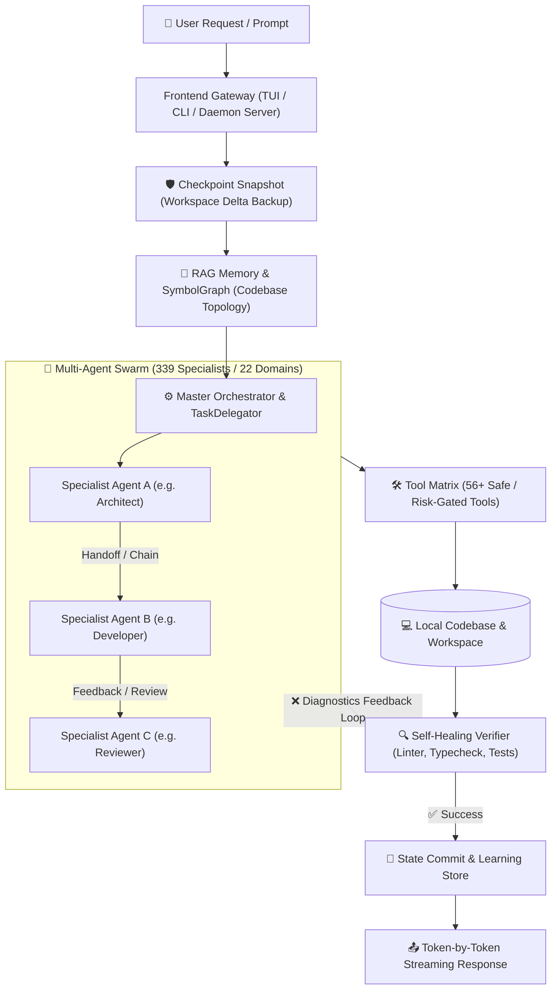
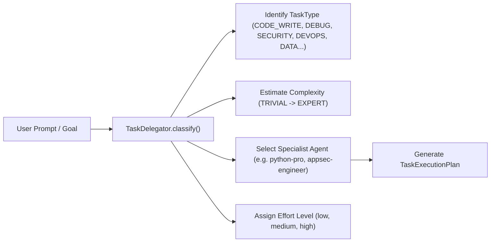

# SAGO System Architecture & Execution Flows

> Comprehensive technical guide to SAGO's internal workflows: Vector DB & RAG Memory, Multi-Agent Swarm Orchestration, Dynamic Task Delegation, Autonomous Tool Execution, Self-Healing Verification, and Detached Background Workers.

---

## Table of Contents

1. [High-Level System Topology](#1-high-level-system-topology)
2. [Vector DB & RAG Memory System](#2-vector-db--rag-memory-system)
3. [Multi-Agent Swarm & Delegation Engine](#3-multi-agent-swarm--delegation-engine)
4. [Multi-Agent Execution Modes](#4-multi-agent-execution-modes)
5. [Typed Context Handoffs & Recursion Protection](#5-typed-context-handoffs--recursion-protection)
6. [Tool Matrix & Risk-Gated Permission Model](#6-tool-matrix--risk-gated-permission-model)
7. [Self-Healing Verification Flywheel](#7-self-healing-verification-flywheel)
8. [Atomic Checkpoints & Workspace Snapshotting](#8-atomic-checkpoints--workspace-snapshotting)
9. [Daemon & Detach Mode Background Workers](#9-daemon--detach-mode-background-workers)
10. [Distributed Peer Mesh Network](#10-distributed-peer-mesh-network)

---

## 1. High-Level System Topology

SAGO is engineered as an autonomous, multi-layered agentic operating system designed to handle complex software engineering workflows without human micromanagement.



---

## 2. Vector DB & RAG Memory System

Implemented across [`sago/memory/`](file:///mnt/ramdisk/sago/sago/memory/), SAGO's memory layer provides high-relevance contextual awareness while avoiding context window overflow.

### The Memory Pipeline

```text
                          ┌────────────────────────┐
                          │   Raw Workspace Code   │
                          └───────────┬────────────┘
                                      │
              ┌───────────────────────┴───────────────────────┐
              │                                               │
              ▼                                               ▼
   ┌──────────────────────┐                       ┌──────────────────────┐
   │ SymbolGraph / AST    │                       │  Codebase Indexer    │
   │ • Classes/Methods/Sigs│                      │  • Sliding-window    │
   │ • Fast instant lookup│                       │    code chunking     │
   └──────────┬───────────┘                       └───────────┬──────────┘
              │                                               │
              │                                               ▼
              │                                   ┌──────────────────────┐
              │                                   │ Vector DB (ChromaDB) │
              │                                   │ • Dense embeddings   │
              │                                   │ • Cosine similarity  │
              └───────────────────────┬───────────┴──────────────────────┘
                                      │
                                      ▼
                      ┌───────────────────────────────┐
                      │    RAG Context Assembler      │
                      │ • Semantic code matches       │
                      │ • Compact symbol outlines     │
                      │ • Recency & importance weight │
                      └───────────────┬───────────────┘
                                      │ (Injected into Agent Prompt)
                                      ▼
                      ┌───────────────────────────────┐
                      │          LLM Engine           │
                      └───────────────────────────────┘
```

### Core Memory Components:
1. **Vector Database Engine (`RAGMemory` in `sago/memory/rag.py`)**:
   * Uses **ChromaDB** with dense neural vector embeddings.
   * Employs hybrid ranking: combines vector similarity score with **Importance Weight** ($0.0 \to 1.0$) and access recency timestamps.
2. **Sliding-Window Codebase Indexer (`CodebaseIndexer` in `sago/memory/codebase_indexer.py`)**:
   * Slices multi-language source files into overlapping semantic code chunks, respecting function boundaries and class headers.
3. **AST Symbol Graph (`SymbolGraph` in `sago/memory/symbol_graph.py` & `ProjectGraph` in `sago/memory/project_graph.py`)**:
   * Extracts function signatures, class hierarchies, and database schemas across 1,000+ files for zero-token-overhead codebase mapping.
4. **Hierarchical Context Compaction (`sago/memory/compaction.py`)**:
   * Automatically compacts long conversations (30+ turns) by summarizing completed tool invocations while preserving key architectural decisions, file paths, and active todos.

---

## 3. Multi-Agent Swarm & Delegation Engine

SAGO houses **339 specialized agents** classified into **22 functional engineering domains**. Orchestration is managed dynamically by `TaskDelegator` ([`sago/orchestrator/delegator.py`](file:///mnt/ramdisk/sago/sago/orchestrator/delegator.py)) and the Unified Orchestrator ([`sago/engine/unified.py`](file:///mnt/ramdisk/sago/sago/engine/unified.py)).

### Dynamic Intent Routing & Classification



---

## 4. Multi-Agent Execution Modes

SAGO provides four distinct orchestration execution paradigms:

```text
1. DIRECT DELEGATION (/delegate <agent> <task>)
   User ──► Master Orchestrator ──► Specialist Agent ──► Result

2. SEQUENTIAL AGENT CHAINING (/chain <agent1,agent2,agent3> <task>)
   User ──► [ System Architect ]
                  │ (Spec & Design)
                  ▼
            [ Backend Engineer ]
                  │ (Code Implementation)
                  ▼
            [ Code Reviewer ] ──► Verified Result

3. PARALLEL AGENT SWARM (/parallel <agent1,agent2> <task>)
   User ──► Dispatcher ──┬──► [ Security Auditor ]   (Thread 1) ──┐
                         ├──► [ Performance Engineer] (Thread 2) ──┼──► Aggregate Report
                         └──► [ Test Engineer ]       (Thread 3) ──┘

4. STATEFUL WORKFLOW ENGINE (sago workflow "<task>")
   State Graph (LangGraph) with Checkpoints, Retries, Condition Nodes & Resumption
```

---

## 5. Typed Context Handoffs & Recursion Protection

To allow seamless collaboration between agents without data loss or infinite loops, SAGO enforces strict handoff protocols:

* **Recursion Guard**: Tracks current delegation depth (`max_depth = 5`). If an agent attempts to delegate beyond the limit, the system gracefully handles the request locally.
* **Cycle & Loop Detection**: Tracks visited agents in a chain. If Agent A calls Agent B, Agent B cannot call Agent A unless explicitly flagged as a feedback loop.
* **Typed State Handoffs**: Passes structured context metadata including created files, active diffs, lint diagnostics, and test outcomes.

---

## 6. Tool Matrix & Risk-Gated Permission Model

Agents interact with the environment via **56+ production tools** registered under `sago/tools/`. Every tool execution is evaluated by the **Permission Manager** ([`sago/permissions.py`](file:///mnt/ramdisk/sago/sago/permissions.py)):

| Risk Level | Operations Included | Security Policy |
| :--- | :--- | :--- |
| **`SAFE`** | Read file, AST symbol lookup, grep search, project graph, list directory | Automatically executed without prompt |
| **`LOW`** | Web search, token cost estimation, lint diagnostics | Auto-allowed with audit log |
| **`MEDIUM`** | Write file, edit file content, create directory | Monitored file diff tracking |
| **`HIGH`** | Bash command execution, package installation (`pip`, `npm`, `cargo`) | User confirmation prompt (or `/yolo` mode) |
| **`CRITICAL`**| Destructive filesystem commands (`rm -rf`), Git force pushes, remote SSH execution | Strict confirmation modal with explicit warnings |

---

## 7. Self-Healing Verification Flywheel

When agents edit code, SAGO automatically runs a background verification loop ([`sago/engine/verifier.py`](file:///mnt/ramdisk/sago/sago/engine/verifier.py)):

```text
                  ┌──────────────────────────────┐
                  │    Agent Writes / Modifies   │
                  │         Code Files           │
                  └──────────────┬───────────────┘
                                 │
                                 ▼
                  ┌──────────────────────────────┐
                  │  Virtualenv-Aware Verifier   │
                  │  Auto-resolves .venv/bin/*,  │
                  │  ruff, pytest, mypy, tsc,    │
                  │  cargo check, go vet         │
                  └──────────────┬───────────────┘
                                 │
                 ┌───────────────┴───────────────┐
                 │                               │
                 ▼                               ▼
       [ ✅ Checks Passed ]            [ ❌ Errors / Lints Found ]
                 │                               │
                 ▼                               ▼
      ┌─────────────────────┐         ┌─────────────────────┐
      │ Commit Workspace &  │         │ Auto-Feed Compiler  │
      │ Stream Success      │         │ Diagnostics back to │
      │                     │         │ Agent Loop to Fix   │
      └─────────────────────┘         └──────────┬──────────┘
                                                 │
                                                 └─► Loop back to Step 1
```

---

## 8. Atomic Checkpoints & Workspace Snapshotting

Before executing high-impact multi-file refactors, SAGO's `CheckpointManager` ([`sago/engine/checkpoint.py`](file:///mnt/ramdisk/sago/sago/engine/checkpoint.py)) takes lightweight atomic snapshots of workspace deltas:

* **Automatic Snapshots**: Triggered before high-risk agent operations.
* **1-Click Rollback (`/checkpoint restore <id>`)**: Reverts modified files back to the exact pre-task state if an agent makes undesirable changes.
* **Zero Overhead**: Uses file hashing and copy-on-write delta storage in `.sago/checkpoints/`.

---

## 9. Daemon & Detach Mode Background Workers

SAGO supports non-blocking detached execution across both CLI and TUI:

```text
1. DETACHED EXECUTION (CLI)
   $ sago run "Run integration test suite" --detach
   ↳ Spawns detached background worker (PID / Daemon)
   ↳ Outputs Task ID and log path (.sago/logs/task_xxx.log)
   ↳ Safe to immediately close the terminal tab

2. REATTACHING ANYTIME (CLI / TUI)
   $ sago attach
   ↳ Displays active sessions and background task logs
   $ sago attach task_xxx
   ↳ Live-tails streaming log (Ctrl+C cleanly detaches again)
   $ sago attach session_id
   ↳ Resumes interactive TUI session directly
```

---

## 10. Distributed Peer Mesh Network

SAGO instances can form local and remote clusters for distributed task distribution:

* **Local Subnet Discovery**: Broadcasts heartbeat pings over UDP port `7654` to auto-discover neighbor SAGO agents on the local network.
* **Daemon Socket / HTTP Mesh (`sago/server/daemon.py`)**: Accepts remote task executions (`sago remote "task" --host <ip>`) and streams responses over Unix sockets or TCP.
